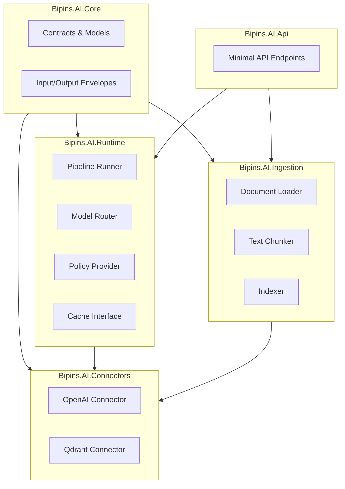

# Bipins.AI - AI Integration Framework

A reusable C#/.NET AI Integration Framework that supports multiple LLM providers and vector databases with a clean, plugin-based architecture.

## Features

- **Multi-Provider Support**: Works with any LLM API (OpenAI, Azure OpenAI, Bedrock, Anthropic, etc.)
- **Vector Database Agnostic**: Supports any vector DB (Qdrant, OpenSearch, pgvector, Pinecone, etc.)
- **Generic Data Envelopes**: Standardized input/output format for all operations
- **Configurable Execution**: Pipelines, steps, policies, routing, retries, caching, observability
- **Pluggable Components**: Easy to add new providers and extend functionality
- **RAG Support**: Built-in retrieval-augmented generation with citations
- **OpenTelemetry**: Distributed tracing for all operations

## Architecture



## Quick Start

### Prerequisites

- .NET 8 SDK
- Docker (for Qdrant)
- OpenAI API key (optional, for LLM features)

### 1. Start Qdrant

```bash
cd deploy
docker-compose up -d qdrant
```

### 2. Configure Environment Variables

```bash
export OPENAI_API_KEY=your-api-key-here
export QDRANT_ENDPOINT=http://localhost:6333
```

Or create an `appsettings.json`:

```json
{
  "OpenAI": {
    "ApiKey": "your-api-key-here"
  },
  "Qdrant": {
    "Endpoint": "http://localhost:6333",
    "CollectionName": "default",
    "VectorSize": "1536"
  }
}
```

### 3. Run the Sample

```bash
cd src/Bipins.AI.Samples
dotnet run
```

This will:
1. Ingest a sample markdown file
2. Query with RAG
3. Display the response with citations and telemetry

### 4. Run the API

```bash
cd src/Bipins.AI.Api
dotnet run
```

The API will be available at `http://localhost:5000` with Swagger UI at `/swagger`.

## API Endpoints

### POST /v1/ingest/text

Ingest text content into the vector store.

**Request:**
```json
{
  "tenantId": "tenant1",
  "docId": "doc1",
  "text": "Your text content here..."
}
```

**Response:**
```json
{
  "status": "Success",
  "resultType": "ingest",
  "data": {
    "chunksIndexed": 5,
    "vectorsCreated": 5
  }
}
```

### POST /v1/chat

Chat with RAG support.

**Request:**
```json
{
  "tenantId": "tenant1",
  "correlationId": "corr1",
  "inputType": "chat",
  "payload": {
    "messages": [
      {
        "role": "User",
        "content": "What is machine learning?"
      }
    ]
  }
}
```

**Response:**
```json
{
  "status": "Success",
  "resultType": "chat",
  "data": {
    "content": "Machine learning is...",
    "modelId": "gpt-3.5-turbo",
    "usage": {
      "promptTokens": 100,
      "completionTokens": 50,
      "totalTokens": 150
    }
  },
  "citations": [
    {
      "sourceUri": "doc1",
      "docId": "doc1",
      "chunkId": "chunk_0",
      "text": "Machine learning is...",
      "score": 0.95
    }
  ],
  "telemetry": {
    "modelId": "gpt-3.5-turbo",
    "tokensUsed": 150,
    "latencyMs": 1200,
    "providerName": "OpenAI"
  }
}
```

### POST /v1/query

Query the vector store directly.

**Request:**
```json
{
  "query": "machine learning",
  "topK": 5
}
```

## Usage

### Basic Setup

```csharp
using Bipins.AI.Core;
using Bipins.AI.Connectors.Llm.OpenAI;
using Bipins.AI.Connectors.Vector.Qdrant;
using Bipins.AI.Ingestion;
using Bipins.AI.Runtime;
using Bipins.AI.Runtime.Rag;

var services = new ServiceCollection();

services
    .AddBipinsAI()
    .AddBipinsAIRuntime()
    .AddBipinsAIIngestion()
    .AddBipinsAIRag()
    .AddOpenAI(o =>
    {
        o.ApiKey = "your-api-key";
        o.DefaultChatModelId = "gpt-3.5-turbo";
    })
    .AddQdrant(o =>
    {
        o.Endpoint = "http://localhost:6333";
        o.DefaultCollectionName = "default";
        o.VectorSize = 1536;
    });
```

### Ingest a Document

```csharp
var pipeline = serviceProvider.GetRequiredService<IngestionPipeline>();

var options = new IndexOptions(
    tenantId: "tenant1",
    docId: "doc1",
    versionId: null,
    collectionName: null);

var result = await pipeline.IngestAsync("path/to/document.md", options);
```

### Query with RAG

```csharp
var retriever = serviceProvider.GetRequiredService<IRetriever>();
var composer = serviceProvider.GetRequiredService<IRagComposer>();
var router = serviceProvider.GetRequiredService<IModelRouter>();

// Retrieve relevant chunks
var retrieveRequest = new RetrieveRequest("your query", topK: 5);
var retrieved = await retriever.RetrieveAsync(retrieveRequest);

// Compose augmented request
var chatRequest = new ChatRequest(new[]
{
    new Message(MessageRole.User, "your query")
});

var augmentedRequest = composer.Compose(chatRequest, retrieved);

// Generate response
var chatModel = await router.SelectChatModelAsync("tenant1", augmentedRequest);
var response = await chatModel.GenerateAsync(augmentedRequest);
```

## Adding a New Provider

### Adding a New LLM Provider

1. Create a new project: `Bipins.AI.Connectors.Llm.YourProvider`

2. Implement `IChatModel`:

```csharp
public class YourChatModel : IChatModel
{
    public async Task<ChatResponse> GenerateAsync(
        ChatRequest request,
        CancellationToken cancellationToken = default)
    {
        // Your implementation
    }
}
```

3. Implement `IEmbeddingModel` (if supported):

```csharp
public class YourEmbeddingModel : IEmbeddingModel
{
    public async Task<EmbeddingResponse> EmbedAsync(
        EmbeddingRequest request,
        CancellationToken cancellationToken = default)
    {
        // Your implementation
    }
}
```

4. Create extension method:

```csharp
public static class YourServiceCollectionExtensions
{
    public static IBipinsAIBuilder AddYourProvider(
        this IBipinsAIBuilder builder,
        Action<YourOptions> configure)
    {
        builder.Services.Configure(configure);
        builder.Services.AddSingleton<IChatModel, YourChatModel>();
        return builder;
    }
}
```

### Adding a New Vector Database Provider

1. Create a new project: `Bipins.AI.Connectors.Vector.YourProvider`

2. Implement `IVectorStore`:

```csharp
public class YourVectorStore : IVectorStore
{
    public async Task UpsertAsync(
        VectorUpsertRequest request,
        CancellationToken cancellationToken = default)
    {
        // Your implementation
    }

    public async Task<VectorQueryResponse> QueryAsync(
        VectorQueryRequest request,
        CancellationToken cancellationToken = default)
    {
        // Your implementation
    }

    public async Task DeleteAsync(
        VectorDeleteRequest request,
        CancellationToken cancellationToken = default)
    {
        // Your implementation
    }
}
```

3. Implement filter translation if needed (translate `VectorFilter` to your provider's format)

4. Create extension method similar to the LLM provider

## Project Structure

```
Bipins.AI/
├── src/
│   ├── Bipins.AI.Core/              # Core contracts and models
│   ├── Bipins.AI.Runtime/           # Pipeline execution system
│   ├── Bipins.AI.Ingestion/         # Document ingestion pipeline
│   ├── Bipins.AI.Connectors/        # Provider connectors
│   ├── Bipins.AI.Api/               # ASP.NET Core Minimal API
│   ├── Bipins.AI.Worker/            # BackgroundService worker
│   └── Bipins.AI.Samples/            # Console sample app
├── tests/
│   ├── Bipins.AI.UnitTests/
│   └── Bipins.AI.IntegrationTests/
├── deploy/
│   └── docker-compose.yml
└── docs/
    └── pipelines/
        └── chat-rag.json
```

## Testing

### Unit Tests

```bash
dotnet test tests/Bipins.AI.UnitTests
```

### Integration Tests

```bash
# Start Qdrant first
cd deploy && docker-compose up -d qdrant

# Run tests
dotnet test tests/Bipins.AI.IntegrationTests
```

## Configuration

### Environment Variables

- `OPENAI_API_KEY`: OpenAI API key
- `QDRANT_ENDPOINT`: Qdrant endpoint (default: http://localhost:6333)
- `QDRANT_API_KEY`: Optional Qdrant API key

### appsettings.json

See `src/Bipins.AI.Samples/appsettings.json` for an example configuration.

## License

[Your License Here]

## Contributing

[Contributing Guidelines]
