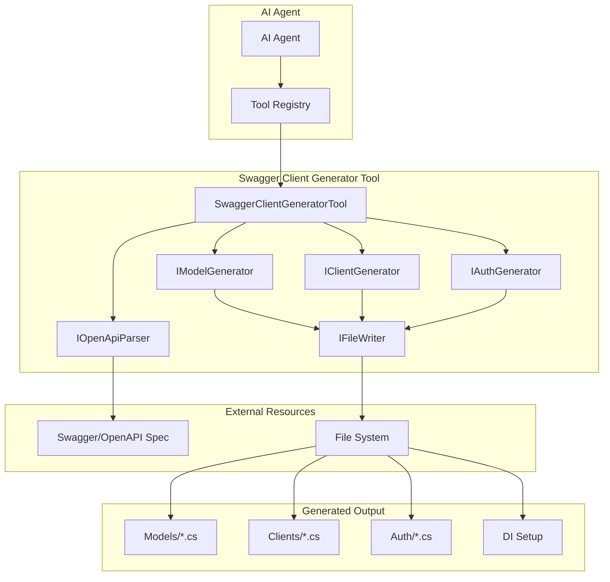
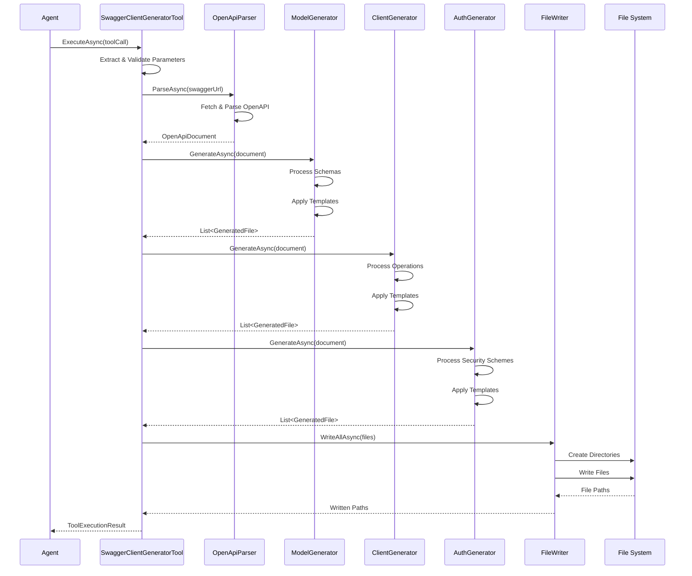
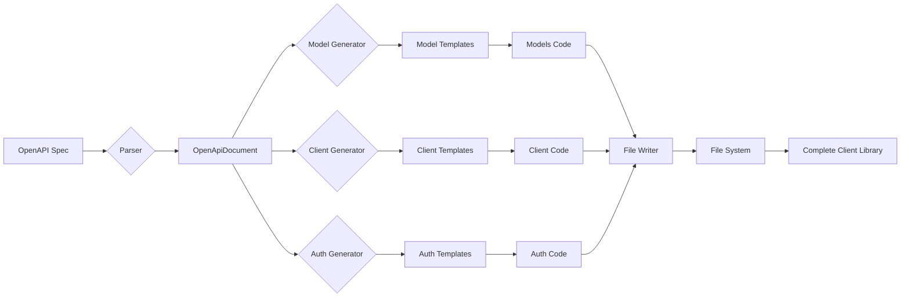
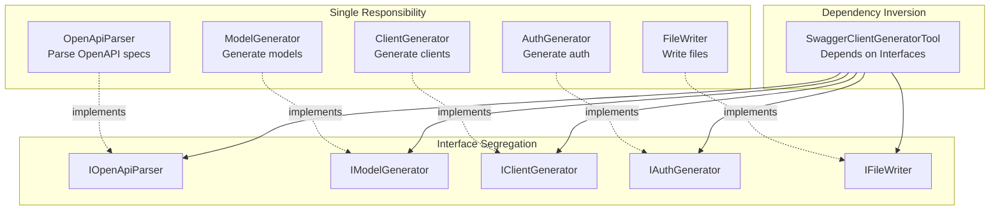
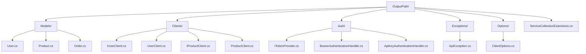
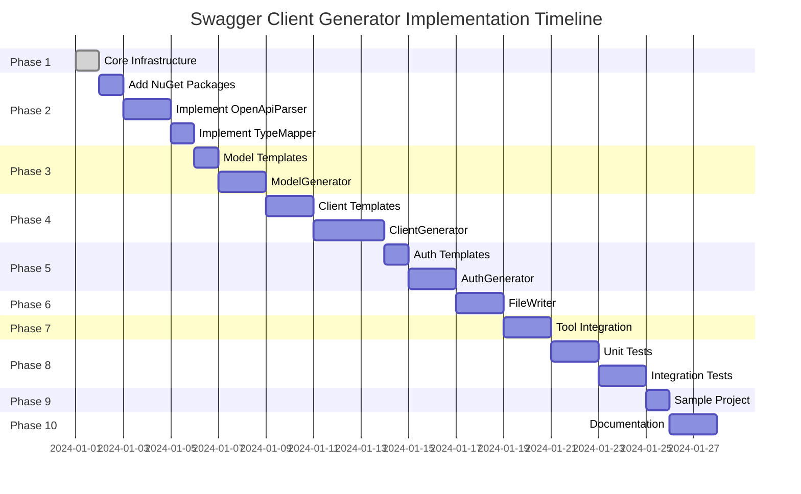
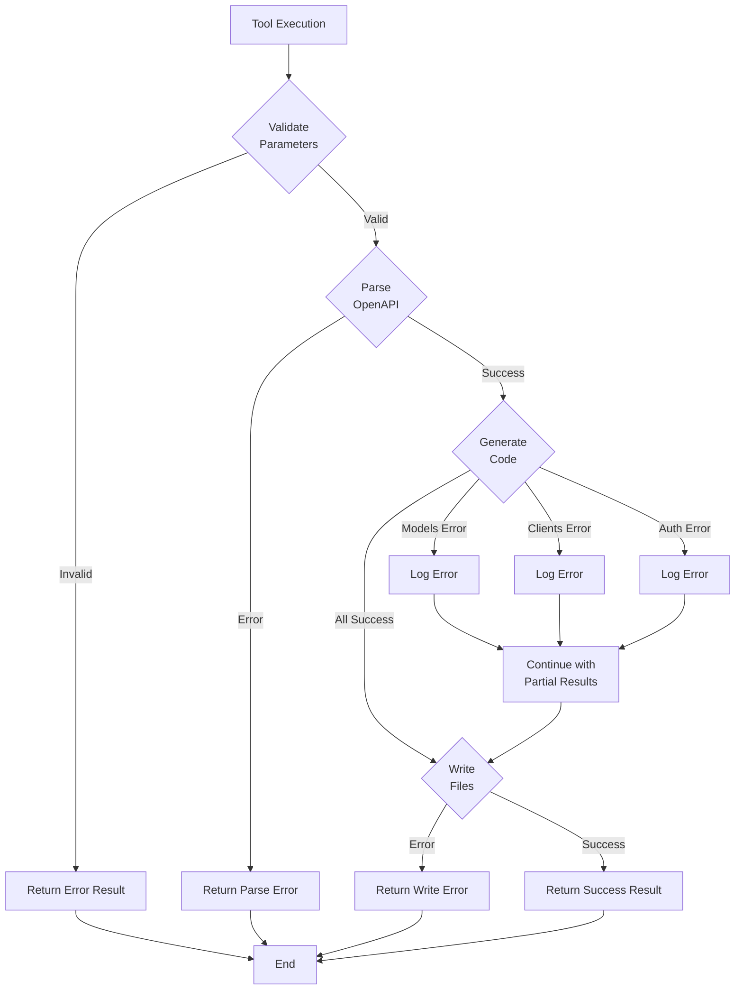
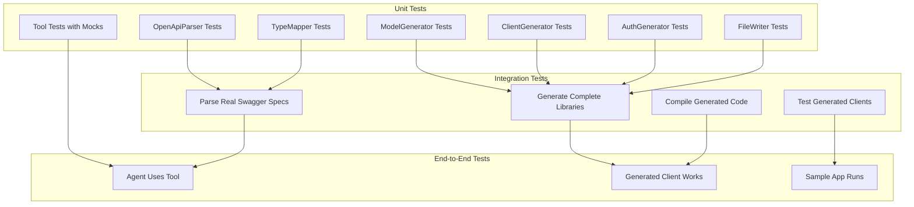

# Swagger Client Generator - Architecture Diagrams

## System Architecture



## Component Interaction Flow



## Code Generation Pipeline



## SOLID Principles Application



## Type Mapping Process

```mermaid
flowchart TB
    Start[OpenAPI Schema] --> Check{Schema Type}
    
    Check -->|string| String[C# string]
    Check -->|integer| Integer{Format?}
    Check -->|number| Number{Format?}
    Check -->|boolean| Bool[C# bool]
    Check -->|array| Array[List&lt;T&gt;]
    Check -->|object| Object{Has Properties?}
    
    Integer -->|int32| Int[int]
    Integer -->|int64| Long[long]
    Integer -->|none| DefaultInt[int]
    
    Number -->|float| Float[float]
    Number -->|double| Double[double]
    Number -->|none| DefaultDouble[double]
    
    Object -->|yes| CustomClass[Custom Class]
    Object -->|no| Dict[Dictionary&lt;string, object&gt;]
    
    String --> StringFormat{Format?}
    StringFormat -->|date-time| DateTime[DateTime]
    StringFormat -->|date| DateOnly[DateOnly]
    StringFormat -->|uuid| Guid[Guid]
    StringFormat -->|byte| ByteArray[byte[]]
    StringFormat -->|none| RegString[string]
    
    Int --> Nullable{Nullable?}
    Long --> Nullable
    Float --> Nullable
    Double --> Nullable
    Bool --> Nullable
    DateTime --> Nullable
    DateOnly --> Nullable
    Guid --> Nullable
    RegString --> Nullable
    
    Nullable -->|yes| NullableType[Type?]
    Nullable -->|no| RegularType[Type]
    
    Array --> ArrayNullable{Nullable?}
    ArrayNullable -->|yes| NullableList[List&lt;T&gt;?]
    ArrayNullable -->|no| RegularList[List&lt;T&gt;]
```

## File Organization Structure



## Implementation Phases



## Error Handling Flow



## Testing Strategy



---

**Note**: All diagrams are in Mermaid format and can be rendered in GitHub, VSCode, or any Markdown viewer with Mermaid support.
