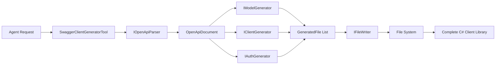

# Swagger Client Generator Tool - Implementation Summary

## ? Completed (Phase 1)

### Core Infrastructure
1. **? GeneratorOptions.cs** - Configuration options for code generation
2. **? GeneratedFile.cs** - Record type representing a generated file
3. **? IOpenApiParser.cs** - Interface for parsing OpenAPI specs
4. **? IModelGenerator.cs** - Interface for generating models
5. **? IClientGenerator.cs** - Interface for generating API clients
6. **? IAuthGenerator.cs** - Interface for generating auth handlers
7. **? IFileWriter.cs** - Interface for writing files to disk
8. **? SwaggerClientGeneratorTool.cs** - Main tool implementation
9. **? ServiceCollectionExtensions.cs** - DI registration (AddSwaggerClientGeneratorTool)
10. **? Documentation** - README and implementation plan

### Tool Features
- ? Proper parameter validation
- ? JSON schema definition for agent use
- ? Options extraction from tool call arguments
- ? Error handling and logging
- ? Follows existing tool patterns (VectorSearchTool, CalculatorTool)

## ?? Next Steps (Use Cursor AI with the Plan)

### Phase 2: Add NuGet Packages
```bash
# Run these commands:
dotnet add src/Bipins.AI/Bipins.AI.csproj package Microsoft.OpenApi.Readers --version 1.6.14
dotnet add src/Bipins.AI/Bipins.AI.csproj package NSwag.CodeGeneration.CSharp --version 14.0.7
dotnet add src/Bipins.AI/Bipins.AI.csproj package Scriban --version 5.9.1
```

### Phase 3: Implement Core Components
Follow the prompts in [docs/tools/SwaggerClientGenerator_CursorAI_Plan.md](../../docs/tools/SwaggerClientGenerator_CursorAI_Plan.md):

1. **OpenApiParser** (Phase 2) - Parse OpenAPI specs from URL or content
2. **TypeMapper** (Phase 2.2) - Map OpenAPI types to C# types
3. **ModelGenerator** (Phase 3) - Generate model/DTO classes
4. **ClientGenerator** (Phase 4) - Generate API client classes
5. **AuthGenerator** (Phase 5) - Generate authentication handlers
6. **FileWriter** (Phase 6) - Write generated files to disk

### Phase 4: Testing & Validation
7. **Unit Tests** (Phase 8.1)
8. **Integration Tests** (Phase 8.2)
9. **Sample Project** (Phase 9)

## ?? Quick Start with Cursor AI

### Step 1: Open Cursor AI
Open Cursor AI with these files in context:
- `src/Bipins.AI/Agents/Tools/BuiltIn/SwaggerClientGeneratorTool.cs`
- `src/Bipins.AI/Agents/Tools/CodeGen/IOpenApiParser.cs`
- `docs/tools/SwaggerClientGenerator_CursorAI_Plan.md`

### Step 2: Start with Prompt 1.1
Copy and paste **Prompt 1.1** from the plan into Cursor AI chat:
```
Add the following NuGet packages to src/Bipins.AI/Bipins.AI.csproj:
[... full prompt text ...]
```

### Step 3: Continue Sequentially
Work through each prompt in order:
- **Prompts 2.x** ? OpenAPI parsing
- **Prompts 3.x** ? Model generation
- **Prompts 4.x** ? Client generation
- **Prompts 5.x** ? Auth handler generation
- **Prompts 6.x** ? File writing
- **Prompts 7.x** ? Integration
- **Prompts 8.x** ? Testing

### Step 4: Test After Each Phase
```bash
# Build project
dotnet build src/Bipins.AI/Bipins.AI.csproj

# Run unit tests
dotnet test tests/Bipins.AI.UnitTests/Bipins.AI.UnitTests.csproj

# Run integration tests
dotnet test tests/Bipins.AI.IntegrationTests/Bipins.AI.IntegrationTests.csproj
```

## ?? Implementation Progress Tracker

| Phase | Component | Status | Files |
|-------|-----------|--------|-------|
| 1 | Core Infrastructure | ? Complete | 10 files |
| 2 | NuGet Packages | ? Pending | - |
| 2 | OpenApiParser | ? Pending | OpenApiParser.cs |
| 2 | TypeMapper | ? Pending | TypeMapper.cs |
| 3 | Model Templates | ? Pending | ModelTemplate.scriban |
| 3 | ModelGenerator | ? Pending | ModelGenerator.cs |
| 4 | Client Templates | ? Pending | 3 templates |
| 4 | ClientGenerator | ? Pending | ClientGenerator.cs |
| 5 | Auth Templates | ? Pending | 2 templates |
| 5 | AuthGenerator | ? Pending | AuthGenerator.cs |
| 6 | FileWriter | ? Pending | FileWriter.cs |
| 7 | Tool Integration | ? Pending | Updates to tool |
| 8 | Unit Tests | ? Pending | Test files |
| 8 | Integration Tests | ? Pending | Test files |
| 9 | Sample Project | ? Pending | Sample app |
| 10 | Documentation | ? Pending | Docs updates |

## ?? How the Tool Works



## ?? Learning Outcomes

By implementing this tool, you'll learn:

1. **OpenAPI/Swagger Specification** - How to parse and understand API specs
2. **Code Generation** - Using templates (Scriban) to generate code
3. **SOLID Principles** - Interface segregation, dependency inversion
4. **Async/Await Patterns** - Proper async implementation in .NET
5. **Type Systems** - Mapping between type systems (OpenAPI ? C#)
6. **Testing Strategies** - Unit tests, integration tests, code compilation tests
7. **AI Agent Tools** - How to build tools that AI agents can use
8. **Roslyn** - Optional: Using Roslyn for code formatting and validation

## ?? Pro Tips

1. **Start Simple** - Implement basic functionality first, then add features
2. **Test Incrementally** - Test each component as you build it
3. **Use Real Specs** - Test with public APIs like PetStore, GitHub, Stripe
4. **Review Generated Code** - Always compile and review generated code
5. **Iterate on Templates** - Templates will need refinement based on real-world use
6. **Handle Edge Cases** - Complex schemas, polymorphism, circular references
7. **Log Extensively** - Good logging helps debug generation issues
8. **Document Well** - Generated code should be self-documenting

## ?? Reference Materials

- [OpenAPI Specification](https://swagger.io/specification/)
- [Microsoft.OpenApi.Readers Docs](https://github.com/microsoft/OpenAPI.NET)
- [NSwag Documentation](https://github.com/RicoSuter/NSwag)
- [Scriban Template Engine](https://github.com/scriban/scriban)
- [.NET HTTP Client Best Practices](https://learn.microsoft.com/en-us/dotnet/fundamentals/networking/http/httpclient-guidelines)

## ?? Usage Example (Once Complete)

```csharp
// Register the tool
services
    .AddBipinsAI()
    .AddOpenAI(options => { ... })
    .AddBipinsAIAgents()
    .AddSwaggerClientGeneratorTool();

// Agent uses the tool
var agent = serviceProvider.GetRequiredService<IAgent>();
var request = new AgentRequest(
    Goal: "Generate a C# client for the GitHub API from https://raw.githubusercontent.com/github/rest-api-description/main/descriptions/api.github.com/api.github.com.json",
    Context: "I need to integrate with GitHub in my .NET application");

var response = await agent.ExecuteAsync(request);

// Tool generates:
// - Models/User.cs, Models/Repository.cs, etc.
// - Clients/IUserClient.cs, Clients/UserClient.cs, etc.
// - Auth/BearerAuthenticationHandler.cs
// - ServiceCollectionExtensions.cs
```

## ?? Success Criteria

The tool is complete when:
- ? Generates compilable C# code
- ? Handles OpenAPI 2.0 and 3.0
- ? Supports common authentication schemes
- ? Includes retry/resilience policies
- ? Follows .NET 8+ conventions
- ? Has >80% test coverage
- ? Documentation is comprehensive
- ? Sample project demonstrates usage
- ? Agent can use it successfully

---

**Ready to build?** Start with [docs/tools/SwaggerClientGenerator_CursorAI_Plan.md](../../docs/tools/SwaggerClientGenerator_CursorAI_Plan.md) and follow the prompts!
