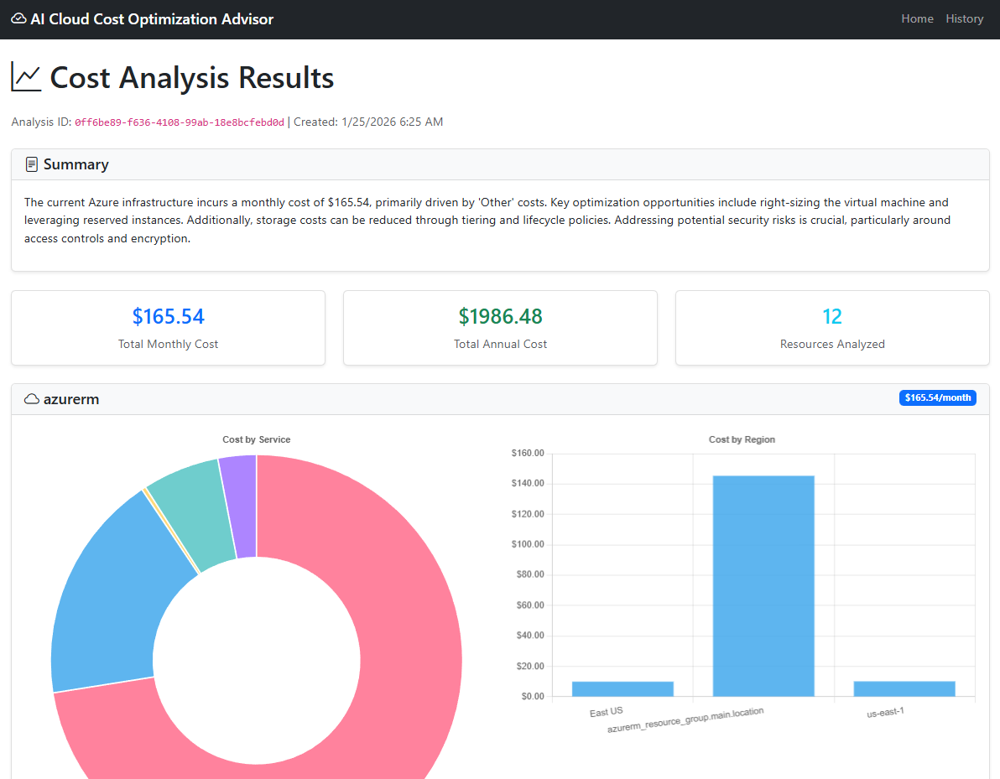
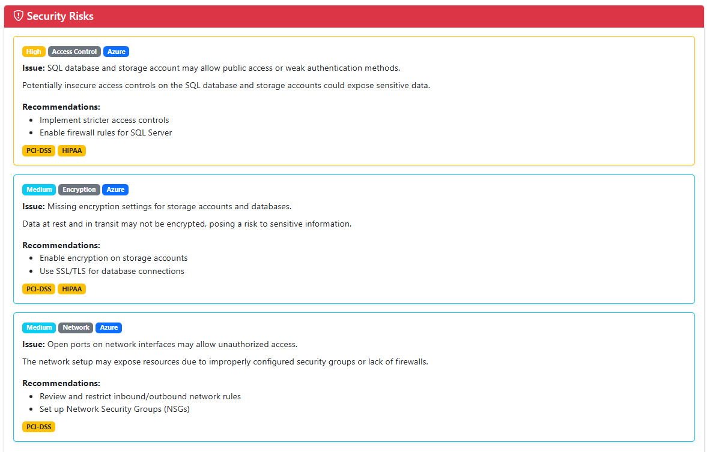
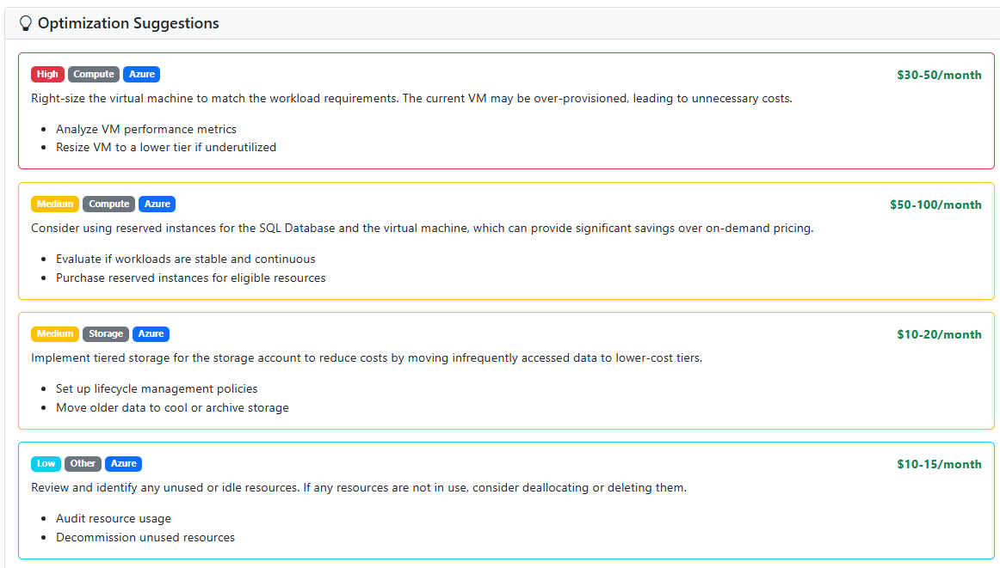

# AI Cloud Cost Optimization Advisor

A web application that analyzes Terraform infrastructure scripts and provides AI-powered cost optimization suggestions for AWS, Azure, and GCP using OpenAI via Bipins.AI.

## Business Features

### 💰 Cost Optimization & Savings
- **Automated Cost Analysis**: Instantly calculate estimated monthly and annual costs for your cloud infrastructure before deployment
- **AI-Powered Optimization Recommendations**: Receive intelligent, prioritized suggestions to reduce cloud spending with estimated savings
- **Multi-Cloud Cost Comparison**: Analyze and compare costs across AWS, Azure, and GCP in a single view
- **Right-Sizing Recommendations**: Get suggestions for optimal resource sizing to eliminate waste and reduce costs

### 🔒 Security Risk Assessment
- **Proactive Security Analysis**: Identify security vulnerabilities and compliance risks in your infrastructure before deployment
- **Risk Prioritization**: Receive security risks categorized by severity (Critical, High, Medium, Low) for focused remediation
- **Compliance Framework Mapping**: Understand which compliance frameworks (PCI-DSS, HIPAA, SOC 2) are affected by identified risks
- **Actionable Remediation Steps**: Get specific recommendations to address each security issue

### 📊 Visual Architecture Insights
- **Before/After Architecture Diagrams**: Visualize your current infrastructure and optimized architecture using Mermaid.js diagrams
- **Cost Breakdown Visualization**: Interactive charts showing costs by service, region, and resource type
- **Resource Inventory**: Complete overview of all cloud resources with associated costs

### ⚡ Operational Efficiency
- **Rapid Infrastructure Analysis**: Analyze Terraform scripts in seconds without manual cost calculations
- **Multiple Input Methods**: Upload files, paste code, or provide URLs for maximum flexibility
- **No Manual Configuration Required**: Automatic resource detection and cost calculation
- **Instant Results**: Get comprehensive analysis results immediately after submission

### 🎯 Business Value
- **Reduce Cloud Costs**: Identify opportunities to save 20-40% on cloud infrastructure costs
- **Prevent Security Breaches**: Catch security misconfigurations before they become vulnerabilities
- **Improve Compliance Posture**: Ensure infrastructure meets regulatory requirements
- **Faster Decision Making**: Get instant insights to make informed infrastructure decisions
- **Risk Mitigation**: Understand and address security and cost risks before deployment

## Screenshots

### Initial UI

*Main application interface where users can upload Terraform files, paste code, or provide URLs, and configure analysis options*

### Cost Analysis Results

*Cost analysis results displayed after clicking "Analyze Costs", showing interactive charts, resource breakdown, and cost estimates by cloud provider*

### Security Risks Analysis

*Security risks identified in infrastructure with severity levels, categories, and remediation recommendations*

### Optimization Suggestions

*AI-powered cost optimization recommendations with priority levels, estimated savings, and actionable steps*

### Architecture Diagrams

*Before/after Mermaid.js architecture diagrams visualizing current infrastructure and optimized architecture*

## Technical Features

- **Multi-Cloud Support**: Analyze Terraform scripts for AWS, Azure, and GCP resources
- **Cost Calculation**: Automatic cost estimation based on resource types and configurations
- **AI-Powered Optimizations**: Get intelligent optimization suggestions using OpenAI
- **Multiple Input Methods**: Upload files, paste code, or provide URLs
- **Visual Cost Breakdown**: Interactive charts showing costs by service and region
- **Resource Analysis**: Detailed breakdown of all resources with estimated costs
- **Security Risk Analysis**: Automated identification of security vulnerabilities and compliance issues
- **Mermaid.js Diagrams**: Visual representation of infrastructure architecture before and after optimization

## Architecture

The application consists of:

- **ASP.NET MVC Backend**: RESTful API and server-side rendering
- **jQuery Frontend**: Interactive UI with Bootstrap and Chart.js
- **Bipins.AI Integration**: Uses `IChatModel` from Bipins.AI with OpenAI provider
- **Terraform Parser**: Regex-based HCL parser for extracting cloud resources
- **Cost Calculator**: Pricing estimation for AWS, Azure, and GCP resources

## Prerequisites

- .NET 8 SDK
- OpenAI API key
- (Optional) Terraform CLI for advanced parsing

## Getting Started

### 1. Configure OpenAI API Key

Set your OpenAI API key in one of the following ways:

**Option A: Environment Variable (Recommended)**
```bash
export OPENAI_API_KEY="your-api-key-here"
```

**Option B: appsettings.json**
```json
{
  "OpenAI": {
    "ApiKey": "your-api-key-here"
  }
}
```

**Option C: User Secrets (Development - Recommended for Local Development)**

For local development, use .NET User Secrets to store your API key securely:

```bash
cd src/AICloudCostOptimizationAdvisor.Web
dotnet user-secrets set "OpenAI:ApiKey" "your-api-key-here"
```

You can also set other OpenAI configuration values:
```bash
dotnet user-secrets set "OpenAI:BaseUrl" "https://api.openai.com/v1"
dotnet user-secrets set "OpenAI:DefaultChatModelId" "gpt-4o-mini"
dotnet user-secrets set "OpenAI:DefaultEmbeddingModelId" "text-embedding-ada-002"
```

To view your secrets:
```bash
dotnet user-secrets list
```

To remove a secret:
```bash
dotnet user-secrets remove "OpenAI:ApiKey"
```

**Configuration Priority:**
1. User Secrets (Development environment only)
2. Environment Variables
3. appsettings.json

### 2. Build and Run

```bash
cd samples/AICloudCostOptimizationAdvisor/src/AICloudCostOptimizationAdvisor.Web
dotnet restore
dotnet build
dotnet run
```

The application will be available at `https://localhost:5001` or `http://localhost:5000`.

### 3. Use the Application

1. Navigate to the home page
2. Choose an input method:
   - **Upload File**: Select a `.tf` file
   - **Paste Text**: Paste Terraform code directly
   - **From URL**: Provide a URL to a Terraform file
3. Select cloud providers to analyze (AWS, Azure, GCP)
4. Optionally enable:
   - AI-powered optimization suggestions
   - Security risk analysis
   - Mermaid.js architecture diagrams (before/after)
5. Click "Analyze Costs"
6. View detailed cost breakdown, optimization suggestions, security risks, and architecture diagrams

## Example Terraform Script

```hcl
# AWS Example
resource "aws_instance" "web" {
  ami           = "ami-0c55b159cbfafe1f0"
  instance_type = "t3.large"
  
  tags = {
    Name = "WebServer"
  }
}

resource "aws_s3_bucket" "data" {
  bucket = "my-data-bucket"
}

# Azure Example
resource "azurerm_virtual_machine" "vm" {
  name                  = "vm-example"
  location              = "East US"
  resource_group_name   = "rg-example"
  vm_size              = "Standard_D2s_v3"
}

# GCP Example
resource "google_compute_instance" "vm" {
  name         = "vm-example"
  machine_type = "e2-medium"
  zone         = "us-central1-a"
}
```

## Project Structure

```
samples/AICloudCostOptimizationAdvisor/
├── src/
│   ├── AICloudCostOptimizationAdvisor.Web/     # ASP.NET MVC Web Application
│   │   ├── Controllers/                        # MVC Controllers
│   │   ├── Views/                              # Razor Views
│   │   ├── wwwroot/                           # Static files (JS, CSS)
│   │   ├── Program.cs                         # Application entry point
│   │   └── appsettings.json                   # Configuration
│   └── Shared/                                 # Shared library
│       ├── Models/                            # Data models
│       └── Services/                          # Business logic services
└── README.md
```

## Services

### TerraformParserService
- Parses Terraform HCL files using regex patterns
- Extracts resources by cloud provider (AWS, Azure, GCP)
- Validates Terraform syntax
- Supports file upload, text input, and URL fetching

### CloudCostCalculatorService
- Calculates estimated costs for AWS, Azure, and GCP resources
- Uses pricing data for common resource types
- Aggregates costs by service and region
- Provides monthly and annual cost estimates

### AICostAnalysisService
- Uses `IChatModel` from Bipins.AI with OpenAI provider
- Generates optimization suggestions based on infrastructure
- Provides actionable recommendations with estimated savings
- Categorizes suggestions by priority and type

## Configuration

### Bipins.AI Source Configuration

The project supports two modes for referencing Bipins.AI:

**Local Mode (Default)**: Uses project references to local `.csproj` files
- Best for development when working with the Bipins.AI source code
- Default behavior - no configuration needed
- Build command: `dotnet build` or `dotnet build -p:BipinsAISource=Local`

**Remote Mode**: Uses NuGet package references
- Best for production, CI/CD, or when Bipins.AI is published as a NuGet package
- Build command: `dotnet build -p:BipinsAISource=Remote`
- With specific version: `dotnet build -p:BipinsAISource=Remote -p:BipinsAIVersion=1.0.0`

You can also set this in `Directory.Build.props`:
```xml
<PropertyGroup>
  <BipinsAISource>Remote</BipinsAISource>
  <BipinsAIVersion>1.0.0</BipinsAIVersion>
</PropertyGroup>
```

### OpenAI Settings

```json
{
  "OpenAI": {
    "ApiKey": "required",
    "BaseUrl": "https://api.openai.com/v1",
    "DefaultChatModelId": "gpt-4o-mini",
    "DefaultEmbeddingModelId": "text-embedding-ada-002",
    "TimeoutSeconds": 60,
    "MaxRetries": 3
  }
}
```

## Cost Estimation

The application provides cost estimates based on:

- **AWS**: EC2, S3, RDS, Lambda, EBS pricing
- **Azure**: Virtual Machines, Storage Accounts, SQL Database, Functions
- **GCP**: Compute Engine, Cloud Storage, Cloud SQL, Cloud Functions

**Note**: These are estimates based on standard pricing. Actual costs may vary based on:
- Usage patterns
- Reserved instances and discounts
- Regional pricing differences
- Data transfer costs

## Limitations

- Terraform parsing uses regex patterns (not a full HCL parser)
- Cost estimates are approximations
- Does not account for reserved instances or discounts
- Limited to common resource types
- Analysis results are cached in memory (not persisted)

## Future Enhancements

- Full HCL parser integration
- Database persistence for analysis history
- Integration with cloud provider pricing APIs
- Support for Terraform modules
- Export analysis reports (PDF, CSV)
- Cost comparison across multiple Terraform scripts

## Troubleshooting

### OpenAI API Key Error
```
InvalidOperationException: OpenAI API key is required
```
**Solution**: Set `OPENAI_API_KEY` environment variable or configure in `appsettings.json`

### No Resources Found
```
BadRequest: No cloud resources found in Terraform script
```
**Solution**: Ensure your Terraform script contains valid resource blocks for AWS, Azure, or GCP

### Analysis Timeout
If analysis takes too long, increase the timeout:
```json
{
  "OpenAI": {
    "TimeoutSeconds": 120
  }
}
```

## License

This sample application is part of the Bipins.AI project and follows the same license.

## Contributing

Contributions are welcome! Please ensure your code follows the existing patterns and includes appropriate tests.
