# AI Cost Optimization Advisor

A serverless application that analyzes AWS Cost Explorer data and provides AI-powered cost optimization suggestions using AWS Bedrock.

## Architecture

### System Overview

```mermaid
graph TB
    subgraph Frontend["Frontend Layer"]
        React[React UI<br/>Static Site]
    end
    
    subgraph API["API Gateway"]
        APIGW[HTTP API<br/>CORS Enabled]
    end
    
    subgraph Lambda["Lambda Functions"]
        GetCost[GetCostData<br/>Lambda]
        Analyze[AnalyzeCosts<br/>Lambda]
        History[GetAnalysisHistory<br/>Lambda]
    end
    
    subgraph Storage["Data Storage"]
        CacheTable[(CostDataCache<br/>DynamoDB)]
        AnalysisTable[(CostAnalyses<br/>DynamoDB)]
    end
    
    subgraph AWS["AWS Services"]
        CostExplorer[AWS Cost Explorer<br/>API]
        Bedrock[AWS Bedrock<br/>Claude Model]
    end
    
    subgraph IAM["IAM Roles & Policies"]
        LambdaRole[Lambda Execution Role]
        CostPolicy[Cost Explorer<br/>Permissions]
        BedrockPolicy[Bedrock<br/>Permissions]
        DynamoPolicy[DynamoDB<br/>Permissions]
    end
    
    React -->|HTTPS| APIGW
    APIGW -->|GET /costs| GetCost
    APIGW -->|POST /analyze| Analyze
    APIGW -->|GET /history| History
    
    GetCost -->|Query| CostExplorer
    GetCost -->|Cache| CacheTable
    GetCost -->|Read/Write| CacheTable
    
    Analyze -->|Invoke| Bedrock
    Analyze -->|Store| AnalysisTable
    Analyze -->|Read| CacheTable
    
    History -->|Query| AnalysisTable
    
    LambdaRole --> GetCost
    LambdaRole --> Analyze
    LambdaRole --> History
    
    CostPolicy --> GetCost
    BedrockPolicy --> Analyze
    DynamoPolicy --> GetCost
    DynamoPolicy --> Analyze
    DynamoPolicy --> History
    
    style React fill:#61dafb
    style APIGW fill:#ff9900
    style GetCost fill:#fa7d00
    style Analyze fill:#fa7d00
    style History fill:#fa7d00
    style CacheTable fill:#4053d6
    style AnalysisTable fill:#4053d6
    style CostExplorer fill:#232f3e
    style Bedrock fill:#ff9900
    style LambdaRole fill:#ff9900
```



For detailed architecture diagrams including data flow, sequence diagrams, and component details, see [docs/ARCHITECTURE.md](docs/ARCHITECTURE.md).

## Features

- **Cost Data Retrieval**: Fetches cost and usage data from AWS Cost Explorer API
- **AI-Powered Analysis**: Uses AWS Bedrock (Claude) to analyze cost patterns and identify optimization opportunities
- **Cost Visualization**: Interactive charts showing cost trends and service breakdowns
- **Optimization Suggestions**: Actionable recommendations with estimated savings
- **Analysis History**: View past cost analyses stored in DynamoDB

## Prerequisites

- .NET 8 SDK
- Node.js 18+ and npm
- AWS CLI configured with appropriate credentials
- AWS SAM CLI installed
- AWS account with:
  - Cost Explorer API access
  - Bedrock access (Claude models)
  - Permissions to create Lambda functions, API Gateway, and DynamoDB tables

## Project Structure

```
AICostOptimizationAdvisor/
├── src/
│   ├── Lambda/
│   │   ├── GetCostData/          # Lambda to fetch cost data
│   │   ├── AnalyzeCosts/          # Lambda to analyze costs with Bedrock
│   │   └── GetAnalysisHistory/    # Lambda to retrieve past analyses
│   └── Shared/                    # Shared models and services
├── frontend/                      # React frontend application
├── infrastructure/
│   ├── cloudformation/
│   │   ├── template.yaml         # AWS SAM template
│   │   └── deploy.sh            # CloudFormation deployment script
│   ├── terraform/
│   │   ├── main.tf               # Terraform main configuration
│   │   ├── variables.tf          # Terraform variables
│   │   ├── outputs.tf            # Terraform outputs
│   │   ├── terraform.tfvars.example  # Example variables file
│   │   ├── deploy.sh            # Terraform deployment script
│   │   └── README.md            # Terraform-specific documentation
│   └── opentofu/
│       ├── main.tf               # OpenTofu main configuration
│       ├── variables.tf          # OpenTofu variables
│       ├── outputs.tf            # OpenTofu outputs
│       ├── terraform.tfvars.example  # Example variables file
│       ├── deploy.sh            # OpenTofu deployment script
│       └── README.md            # OpenTofu-specific documentation
└── README.md
```

## Setup

### 1. Build Lambda Functions

```bash
cd samples/AICostOptimizationAdvisor
dotnet restore
dotnet build
```

### 2. Setup Frontend

```bash
cd frontend
npm install
```

### 3. Configure Environment

Create a `.env` file in the `frontend` directory:

```env
VITE_API_BASE_URL=https://your-api-gateway-url
```

## Deployment

### Option 1: Deploy with AWS SAM (CloudFormation)

1. Build and package Lambda functions:
```bash
cd infrastructure/cloudformation
./deploy.sh
```

Or manually:
```bash
# Build Lambda functions
dotnet build src/Lambda/GetCostData/GetCostData.csproj -c Release
dotnet build src/Lambda/AnalyzeCosts/AnalyzeCosts.csproj -c Release
dotnet build src/Lambda/GetAnalysisHistory/GetAnalysisHistory.csproj -c Release

# Build frontend
cd frontend
npm install
npm run build

# Deploy with SAM
cd ../infrastructure/cloudformation
sam build
sam deploy --guided
```

### Option 2: Deploy with Terraform

1. Copy the example variables file:
```bash
cd infrastructure/terraform
cp terraform.tfvars.example terraform.tfvars
```

2. Edit `terraform.tfvars` with your desired values

3. Deploy:
```bash
./deploy.sh
```

Or manually:
```bash
terraform init
terraform plan
terraform apply
```

See `infrastructure/terraform/README.md` for detailed Terraform instructions.

### Option 3: Deploy with OpenTofu

1. Copy the example variables file:
```bash
cd infrastructure/opentofu
cp terraform.tfvars.example terraform.tfvars
```

2. Edit `terraform.tfvars` with your desired values

3. Deploy:
```bash
./deploy.sh
```

Or manually:
```bash
tofu init
tofu plan
tofu apply
```

See `infrastructure/opentofu/README.md` for detailed OpenTofu instructions.

**Note**: OpenTofu is an open-source fork of Terraform and is fully compatible with Terraform configurations. You can use either tool interchangeably.

2. After deployment, note the API Gateway URL from the outputs.

3. Update the frontend `.env` file with the API Gateway URL.

4. Deploy frontend to S3/CloudFront or serve locally:
```bash
cd frontend
npm run build
# Upload dist/ folder to S3 bucket or serve with a static web server
```

## Local Development

### Run Frontend Locally

```bash
cd frontend
npm run dev
```

The frontend will run on `http://localhost:5173` (Vite default port).

### Test Lambda Functions Locally

You can use AWS SAM CLI to test Lambda functions locally:

```bash
cd infrastructure
sam local invoke GetCostDataFunction -e events/get-costs-event.json
```

## API Endpoints

- `GET /costs?startDate=YYYY-MM-DD&endDate=YYYY-MM-DD&granularity=DAILY` - Fetch cost data
- `POST /analyze` - Analyze cost data and get optimization suggestions
- `GET /history?limit=10` - Get analysis history

## DynamoDB Schema

### CostDataCache Table
- **Partition Key**: `date` (String)
- **Sort Key**: `service` (String)
- **TTL**: `ttl` (Number) - 24 hours

### CostAnalyses Table
- **Partition Key**: `analysisId` (String, UUID)
- **Sort Key**: `timestamp` (Number, Unix timestamp)

## IAM Permissions Required

The Lambda functions require the following permissions:

- **GetCostDataFunction**:
  - `ce:GetCostAndUsage`
  - `ce:GetDimensionValues`
  - `dynamodb:GetItem`
  - `dynamodb:PutItem`

- **AnalyzeCostsFunction**:
  - `bedrock:InvokeModel`
  - `dynamodb:PutItem`

- **GetAnalysisHistoryFunction**:
  - `dynamodb:Scan`
  - `dynamodb:Query`

## Cost Considerations

- **Lambda**: Pay per invocation and compute time
- **API Gateway**: Pay per API call
- **DynamoDB**: On-demand billing (pay per request)
- **Bedrock**: Pay per token (input and output)
- **Cost Explorer API**: Free (included with AWS account)

## Troubleshooting

### Lambda Function Errors

- Check CloudWatch Logs for detailed error messages
- Verify IAM permissions are correctly configured
- Ensure Bedrock model access is enabled in your AWS account

### Frontend API Errors

- Verify API Gateway URL is correct in `.env` file
- Check CORS configuration in API Gateway
- Ensure API Gateway is deployed and accessible

### Cost Explorer API Errors

- Verify Cost Explorer is enabled in your AWS account
- Check that the date range is valid (Cost Explorer typically has a 12-13 month lookback)
- Ensure IAM role has `ce:GetCostAndUsage` permission

## License

This is a sample project for demonstration purposes.
