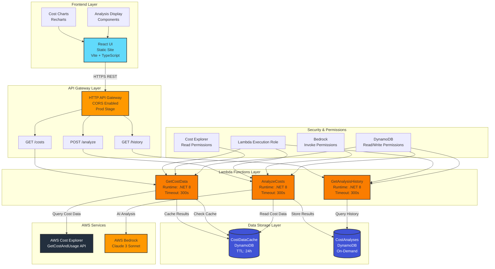
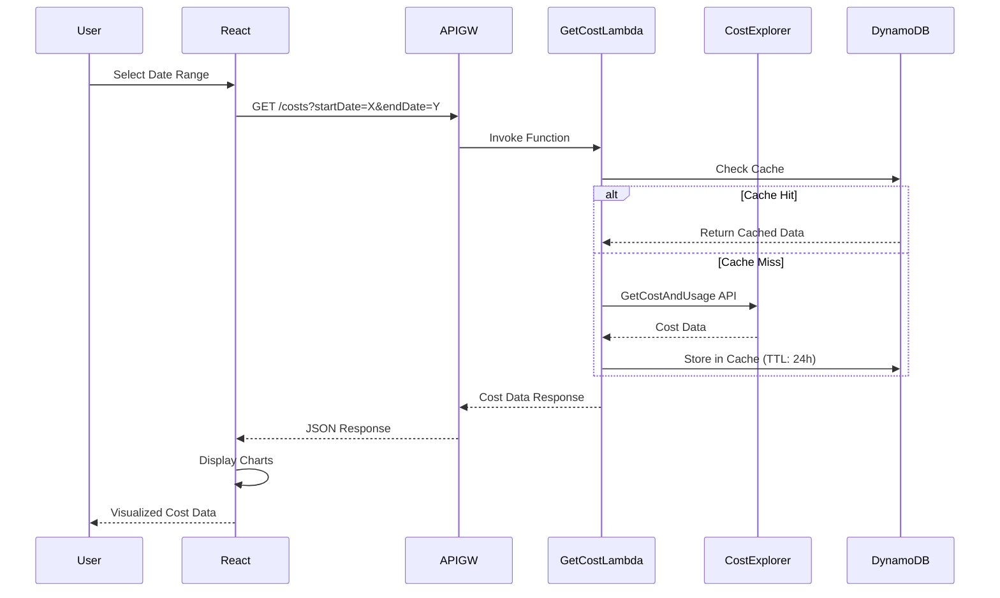
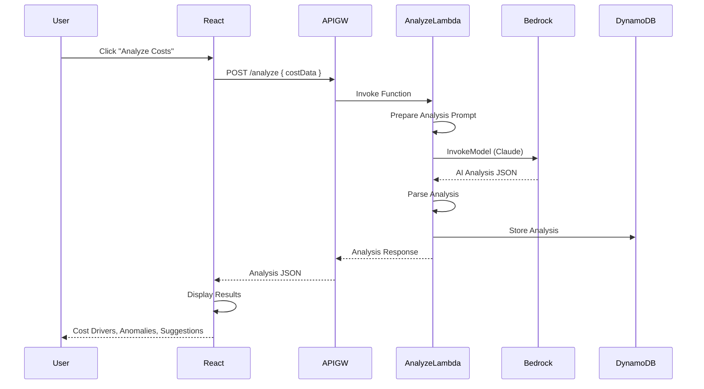
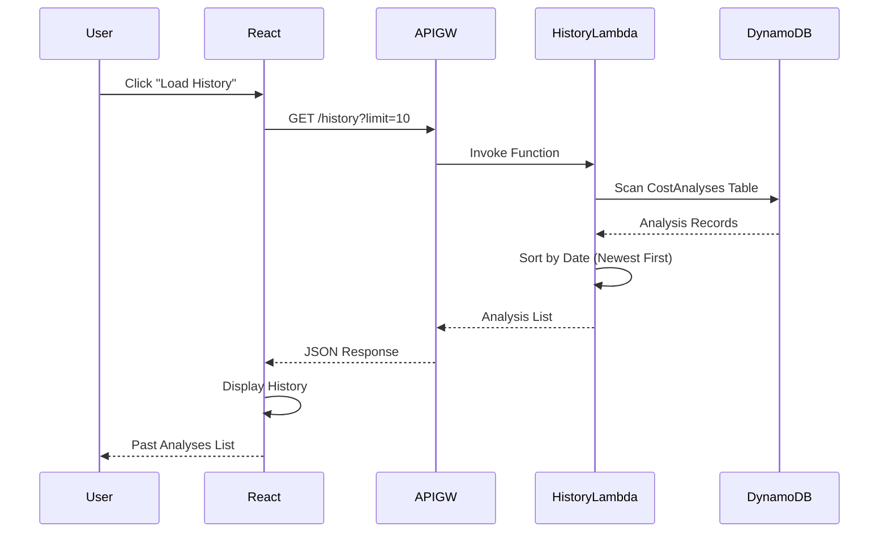
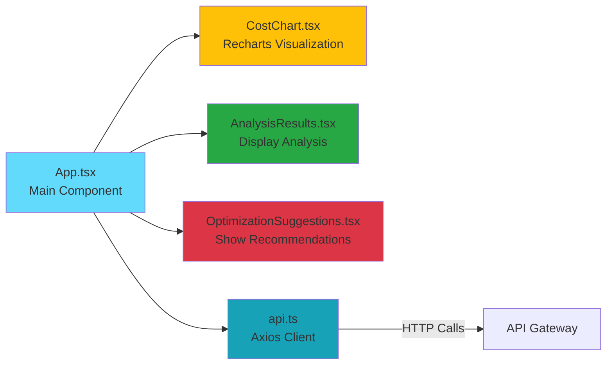
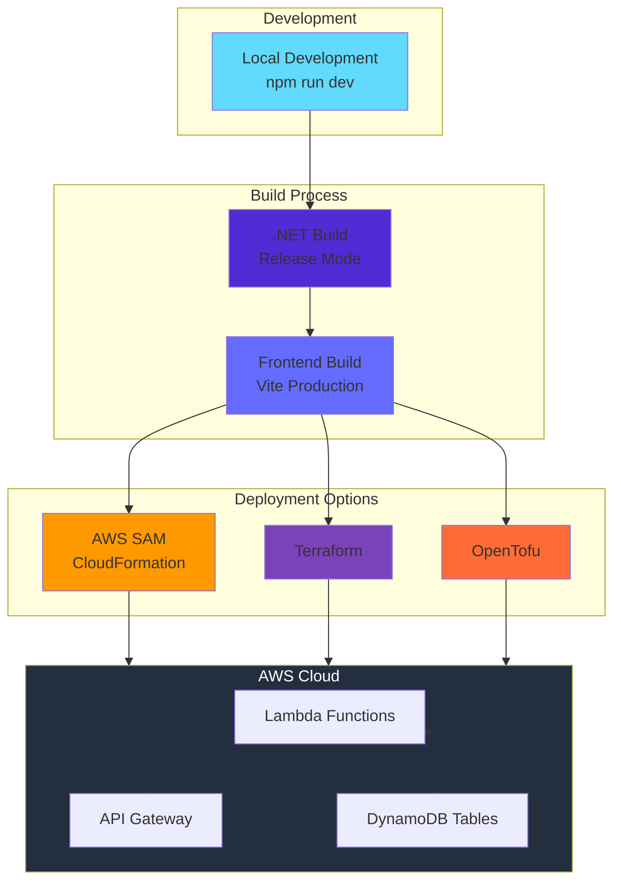
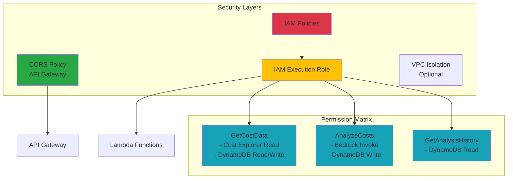
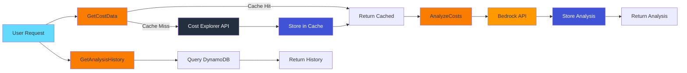

# AI Cost Optimization Advisor - Architecture

## System Architecture



## Data Flow

### 1. Cost Data Retrieval Flow



### 2. Cost Analysis Flow



### 3. Analysis History Flow



## Component Details

### Frontend Components



### Lambda Function Architecture

```mermaid
graph TB
    subgraph GetCostData["GetCostData Lambda"]
        GC1[Parse Request<br/>Date Range]
        GC2[Check DynamoDB Cache]
        GC3[Query Cost Explorer]
        GC4[Transform Response]
        GC5[Cache Results]
    end
    
    subgraph AnalyzeCosts["AnalyzeCosts Lambda"]
        AC1[Parse Cost Data]
        AC2[Build Bedrock Prompt]
        AC3[Invoke Bedrock]
        AC4[Parse AI Response]
        AC5[Store in DynamoDB]
    end
    
    subgraph GetHistory["GetAnalysisHistory Lambda"]
        GH1[Query DynamoDB]
        GH2[Sort by Date]
        GH3[Format Response]
    end
    
    GC1 --> GC2
    GC2 -->|Cache Miss| GC3
    GC3 --> GC4
    GC4 --> GC5
    
    AC1 --> AC2
    AC2 --> AC3
    AC3 --> AC4
    AC4 --> AC5
    
    GH1 --> GH2
    GH2 --> GH3
```



## Infrastructure Components

### DynamoDB Schema

```mermaid
erDiagram
    CostDataCache ||--o{ CostEntry : contains
    CostAnalyses ||--o{ AnalysisEntry : contains
    
    CostDataCache {
        string date PK
        string service SK
        string costData
        number ttl
    }
    
    CostAnalyses {
        string analysisId PK
        number timestamp SK
        string costData
        string dateRange
        string createdAt
    }
```

## Deployment Architecture



## Security Architecture



## Cost Flow


